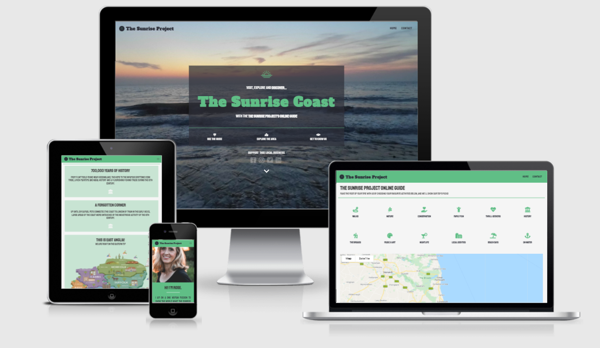
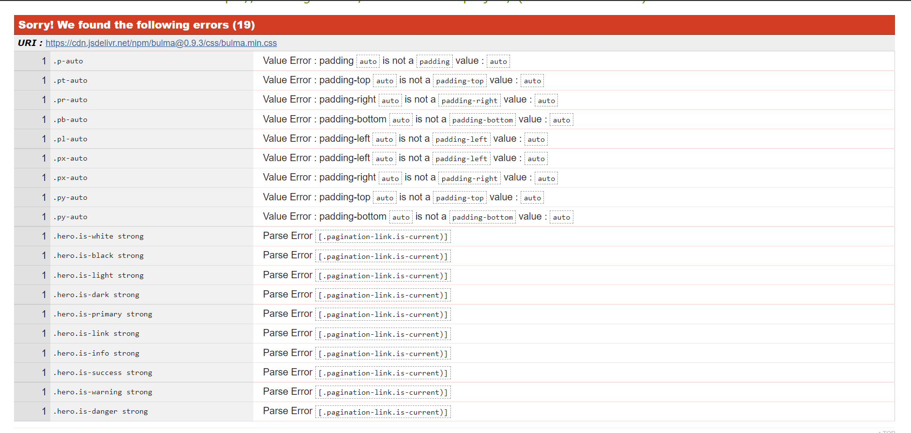

# The Sunrise Project - A Visitors Guide
> This project is for purely educational purposes only. Content and information within this project may not be 100% accurate and is based on a fictitious tourism board.

With the event of COVID-19 resulting in the dramatic increase in staycations, The Sunrise Project (a small collective of local buisiness owners) came together to promote the area of the Suffolk coast known locally as the 'Sunrise Coast', the most easterly coastline in the country, not only to visitors from outside the area, but to local people who may not know what lies right on their doorstep.

This website is the company's primary marketing method, and offers an online information center for the Sunrise Coast, complete with an interactive guide to help visitors make the most of their day out. As the area advertised is not well-known outside of Suffolk, this means that the website will serve as an introduction as well as a guide to the local area.

[The deployed site can be found here.]()

# Table of Contents
* [UX]()
    * [i. User Stories]()
        * [Users]()
        * [Owners]()
    * [ii. Strategy]()
        * [Project inception]()
        * [Research]()
    * [iii. Scope]()
        * [Target audience]()
        * [Requirements]()
        * [Limitations]()
    * [iv. Structure]()
        * [Architecture]()
        * [Website flow]()
    * [v. Skeleton]()
        * [Wireframes & changes]()
    * [vi. Surface]()
        * [Initial considerations]()
        * [Palette]()
        * [Typography]()
        * [Iconography & imagery]()
* [Features]()
    * [i. Navigation menu & hero image]()
    * [ii. Section toggle buttons]()
    * [iii. Online guide]()
        * [Interactive buttons]()
        * [Googe Maps]()
        * [Location results]()
    * [iv. Information page]()
    * [v. Owner profile]()
    * [vi. Contact section]()
    * [vii. Footer]()
    * [vi. Contact modal]()
    * [Possible future features]()
* [Responsive design]()
* [Accessibility]()
* [Validation]()
* [Testing]()
* [Issues & improvements]()
* [Deployment]()
* [Technologies & tools]()
* [Credits & acknowledgements]()

# **UX**
## **i. User stories**
The website is targeted at anyone who wishes to visit the Sunrise Coast (both local and external visitors), and aims to provide them with the best location for their day out.

### Users
*As a user, I want...*
* The website to immediately communicate its purpose so I know what to expect from the site
* The website to be easily readable and easy to navigate so that I can find the information that I need
* To see the various attractions and activities that are available in each location
* To see images of each location so that I know it's somewhere I would like to visit
* Contact information of the owner available in case I have any queries
* To know the story behind the Sunrise Coast to decide whether I would like to visit the area
* The website to respond to my interaction, without any unresponsive buttons
* The website to be responsive so I can view it on my phone or tablet if I am out and about
* To see maps of the local area so I know where to go

### Owners
*As the business owner, I want...*
* Highlight the fact that this website is a guide for visitors
* The website to allow and encourage users to engage with the interactive parts of the website to encourage them to visit the area based on its recommendations
* To promote the local area to visitors
* To offer our top 5 recommended attractions for each area
* To make visitors feel welcome to the site and in turn, to the local area
* Encouage visitors to get in touch with us if they have any questions regarding their day out

## **ii. Strategy**
### Project inception
I was inspired to create this website due to the rise in staycations around the UK following the COVID-19 travel restrictions from 2020 - 2021, and possibly beyond. My hometown sits on a strip of coastline called the 'Sunrise Coast', and has historically been a tourism spot since the Victorian times (since the town was connected to London by railway).

I thought that a guide to the Sunrise Coast would be an ideal project to work on for two main reasons:
1) The area needs revenue from tourism more than ever, due to the economic and social decline the area has experienced in the last 20-30 years, and the rise in staycations could be a perfect time to encourage visitors to the area
2) It would help and uplift local people by pointing out little corners of the area that they might be unaware of, or haven't had the chance to visit yet, and also raise awareness of local businesses and organisations who rely on local (and external visitor) spending

### Research
To find my own inspiration for the site, I looked at other tourism board's websites for ideas, whilst taking into consideration time restraints and my own JavaScript/jQuery abilities. I was looking out for interactive elements of the websites that I could apply to my own fictional tourism board, and I found myself drawing the most inspiration from [Visit Devon](https://www.visitdevon.co.uk/), [Visit England](https://www.visitengland.com/) and [Discover Lowestoft](https://www.discoverlowestoft.co.uk/).

## **iii. Scope**
### Target audience
The target users of this website are both local people and external visitors who wish to look for some inspiration for their visit to the Sunrise Coast, and as the area is not well-known outside of the county of Suffolk, this means that the website serves as an introduction and a guide to the local area.

### Scope table of interactive features
To ensure I was including the most important interactive features/information that potential visitors would need, I planned out exactly what the scope for this website would be:

* A simple guide for those looking for a day out in the Sunrise Coast

Now that I had a scope, I could focus and define exactly what I would need for the upcoming project. I began to plan and asked various friends and family what they believed should be included on a local tourism board's website. The interactive guide was the component that interested users the most, as it engaged with potential visitors and suggested helpful information for those visiting the area for the first time. Below is all of the suggestions I accumulated which helped me to decide what to include:

Potential feature | Importance | Viability | Overall score
------------ | ------------- | ------------ | -------------
***INTERACTIVE GUIDE***
Clickable activity options | 5 | 5 | 10
Reset button for guide | 1 | 4 | 5
Button to 'show all' locations | 1 | 5 | 8
Blur effect on unselected activities | 2 | 5 | 7
Toggle for visitor age range | 3 | 2 | 5
Toggle/calendar for date range | 3 | 2 | 5
Toggle for specific section of the webpage | 5 | 2 | 4
Zoomable Google Maps with markers for each location | 5 | 5 | 10
***INFOMATION PAGE***
Live weather report | 1 | 3 | 4
Live pollen report | 1 | 3 | 4
Clickable Google Maps markers that trigger accordians | 1 | 1 | 2
***OWNER INFORMATION***
Accordian with the owner's name, backstory and information | 5 | 4 | 10
***CONTACT MODAL*** 
Submissable enquiry to owner | 5 | 5 | 10
Clickable submit button | 5 | 5 | 10

### Final interactive features
I narrowed down the scope to the final interactive features which would be included alongside the HTML/CSS features:

*INTERACTIVE GUIDE*
* Clickable activity buttons which drops makers on the map
* Zoomable Google Maps
* Map locations to display image, name and link to 'top 5' picks from the activities

*LOCATION PAGE*
* In the end, this ended up being a toggleable static section using [Bulma tiles](https://bulma.io/documentation/layout/tiles/) to create an inviting layout for the user, and each tile is hoverable so the background colour changes

*OWNER INFORMATION*
* Due to time constraints, this page is also a simple static, toggleable section detailing the owners aim with the website

*CONTACT MODAL*
* Submissable enquiry to owner
* Clickable submit button 

### Limitations
I realised that I would need to keep the scope quite tight due to time constraints and my JavaScript / jQuery abilities, but this helps to keep the website to the the most important components that users will require. I also only have one previous experience building a website, so there may be limitations in terms of user experience and desgin combined with interactive elements. There were also considerable time constraints which meant  alot of elements and ideas were either dropped or rearranged into a new feature.

## **iv. Structure**
### Architecture

*INFORMATION ARCHITECTURE*
* The original idea for this website was to have the location pages on separate pages, but after speaking with my mentor, it became apparent that it would be more efficient and sleeker to have the top 5 picks toggled when the activities were selected by the user. Therefore, the website is contained to one page, with static and dynamic display of content depending on user interaction.

*ORGANISATION ARCHITECTURE*
* **Header**: The header contains a collapsable navigation menu, the main title of the webpage and links to social media 
* **Circular tabs (toggle each section)**: These tabs toggle the sections below
* **Interactive guide**: The guide contains the activity buttons and the Google Maps render, which markers drop onto depending on the activity chosen
* **Information**: The information section is a static page which displays general information and facts about the area
* **Owner information**: The owner info section is a static page which describes the owner of the website and her aim
* **Contact**: The contact section is not toggleable, but displays the methods by which the user can get in touch with the owner, including a link to toggle the contact form modal
* **Footer**: Social media links, contact information reinforced and the company logo 

### Website flow
The website is designed on one page with three toggleable sections, one small contact section, the footer and a toggleable contact form modal. The idea is that the user is welcomed with the header (and the hero image of the sunrise) and is indicated downwards by the layout and icons. 

From there, they can toggle each section as they please - each section toggles downwards, and the user is guided down the page by the design and interactive components. The contact section and the footer remain at the bottom of the page as per good UX practices.

## v. Skeleton
### Initial design 
The inital design of the website was different to how the deployed product turned out. [These wireframes](https://github.com/lmw95/MS2-thesunriseproject/tree/main/assets/wireframes) demonstrate the original idea - I have described the differences in the wireframes below, [click here]() to see the updated wireframes. I used [Balsamiq](https://balsamiq.com/) to build my wireframes.

* **Header**: The webpage title is now centered within a div which is itself also centered in the middle of the hero body. There are now only two items in the navigation menu and the background no longer scrolls, it is just a static image.
* **Information center**: This is now a toggleable subsection with Bulma tiles containing content about the area.
* **'Meet the team'**: This is now one singular owner with her own toggleable section. Half of the section is her profile picture and the other half is information about her.
* **'Be inspired'** This section does not exist anymore.
* **Online guide**: The online guide is now in its own toggable section, but retains a similar layout to the wireframe, only now there are 12 activites for the user to interact with, and each one returns markers on the map. Below the map, there are now five [Bulma cards](https://bulma.io/documentation/components/card/) which return an image, the name of the locations marked on the map, and a link to the company's site. The activity buttons no longer return a location, rather places markers on the map and returns information about the local companies themselves. I found this to a much better experience building but also in the mindset of a user, who would rather see local companies than pages about whole towns.
* **Contact**: The contact section retains the 'Download a brochure' and a button that toggles the contact modal, but there is also an extra section that provides a phone number too. 
* **Footer**: The footer remains the same, but with the company logo at center.

## **vi. Surface**
### Initial considerations
I wanted to the website to be fun yet informative, and match the overall theme of the area (rugged countryside and the sea, but turned readable and bubbly). I used a consistent palette that kept on theme throughout the site, using only three colours.

*COLOUR PALETTE*


The palette is fresh and provides plenty of contrast, and includes a light green to represent the countryside, a navy blue for the sea and white for section backgrounds. It helps the user to visualise the area they are looking into. I used [Coolors](https://coolors.co/) to generate this palette.

*TYPOGRAPHY*

I used two fonts from [Google Fonts](https://fonts.google.com/):
* [Staatliches](https://fonts.google.com/specimen/Staatliches?category=Display,Handwriting&query=staat) for subtitles and general content
* [Alfa Slab One](https://fonts.google.com/specimen/Alfa+Slab+One?category=Display,Handwriting&query=alfa+sla) for headings, as it is bold and packs a punch on the site on first viewing

*ICONOGRAPHY & IMAGERY*

I used icons from [Font Awesome](https://fontawesome.com/) and flaticons from [Flaticon](https://www.flaticon.com/). All images were used to represent the content of the site, and the sources can be found in the [credits]().

# **Features**
## **Navigation menu & hero image**

The navigation menu is set to transparent when at the top of the page, but turns green when the user starts to scroll down the page. It is fully responsive and the menu collapses into a burger menu when viewed on mobile and tablet screens. The home item takes the user to the top of the page, and the contact item opens the contact form modal.

Upon entering the website, the hero image of the sunset and the desription in the central box is the first thing the user sees, indicating what the website is for. Underneath the title is the social media links and a bouncing icon which indicates the user to go down the page.

## **Section toggle buttons**

The semi-circle toggle buttons sit underneath the bouncing icon which indicates the user to page down. When clicked, each button toggles a different section: 'Online guide' toggles the online guide section, 'The sunrise coast' toggles the information section and the 'About the project' section toggles the owner profile.


## **Online guide**
### Interactive buttons

These buttons describe different activities that the user can select from. Each button drops five markers on the map below, using the coordinates of the 'top 5' businesses used in [maps.js](https://github.com/lmw95/MS2-thesunriseproject/blob/main/assets/js/maps.js). Each button has an activity name and a corresponding icon.

### Google Maps

This section is where the Google Maps is rendered. The markers are dropped on the map, as seen in the picture; the example used here is 'Music & Art'. The map is zoomable. The previous markers clear off the map when each activity is clicked. 

### Location results
*Before*


*After*


The location results display according to user interaction. Before selection, the results are shown as blank, as seen in the before picture above, whereas after user selection, they will display the 'top 5' locations (i.e. the locations marked on the map). The letters correspond to the markers on the map. The links will take the user to the company's website. These cards were made using [Bulma cards](https://bulma.io/documentation/components/card/).

## Information page 

This section is toggleable and is a static page displaying information about the local area. It is formatted using [Bulma tiles](https://bulma.io/documentation/layout/tiles/). The tiles are hoverable and change the background colour. The page would have revealed more content when the user scrolled down, but due to time constraints this idea was abandoned.

## Owner profile

This section is toggleable and is also a static page displaying information about the owner 'Rose' and her aim with and the purpose of the website. I had an idea of placing an accordian inside the content section, which toggled backstory, aim and profile, but due to time constraints this idea also did not come to fruition. 

## Contact section 

The contact section simply displays contact details of the owner, and also includes a link on the 'click here' paragraph which toggles the contact modal.

## Footer 

The footer includes reinforcement of contact information of the owner on the left, a different version of the logo of the company in the center and social media links in the right corner.

## Contact modal 

The modal is toggled when the user clicks on the 'contact' menu item, or on the 'click here' link. The user is able to submit an enquiry, and upon submission a paragraph appears confirming submission if successful. The form also clears upon submission. 

## Possible future features
Some ideas that I would like to implement in the future would be:
* A weather API displaying the current weather in the local area.
* A carousel in the information section displaying the list of endangered animals that live locally.
* The accordian feature in the owner profile as mentioned previously
* More sections of the website - such as local / upcoming events, information about the actual towns (Lowestoft, Yarmouth, Kessingland and Oulton Broad) and a broader history section. 

# **Responsive design**
The website is designed to be fully responsive on screens sized from 320px and upwards. I achieved this by utilising media queries in my [stylesheet](https://github.com/lmw95/MS2-thesunriseproject/blob/main/assets/css/style.css). As seen in the [Am I Responsive?](http://ami.responsivedesign.is/) viewer, the website is able to be viewed on all popular screen sizes. See responsive testing [here]().



# **Accessibility**
I wanted to ensure that my website would be able to be accessabile to a wide as an audience as possible, taking into consideration screen readers, colourblindness and other sight conditions. 

*SCREEN READERS*

To ensure that my website is fully accessbile to users with screen readers, I ensured that all the `````` tags had an ```alt``` property which would allow the user to know what the image depicted.

*COLOURBLINDNESS* 

When choosing my colour palette, I chose colours that would still provide contrast to users who have sight conditions that affect seeing colour. This process was done using [Coolors](https://coolors.co/) colourblindness tester, as seen below the colours I selected still provide a contrast and would be readable for a user with these conditions:

**Protanopia**


**Deuteranopia**


**Tritanopia**


**Achromatopsia**


**Protanomaly**


**Deuteranomaly**


**Tritanomaly**


**Achromatomaly**


*LIGHTHOUSE REPORT*

Using Google Chrome's Lighthouse feature, I was able to check the final accessibility score for the website on both mobile and desktop, which was 100%: 


# **Validation**
## **W3C Markup Validaton - Initial report**
The [W3C Markup Validation tool](https://validator.w3.org/) returned one error, which turned out to be caused be a typo in the tag name.


After this typo was corrected, the W3C validator returned no errors.


## **W3C CSS Validaton - Inital/final report**
The [W3C validation tool](https://jigsaw.w3.org/css-validator/) returned errors in the report that are beyond the developer's control as they are part of the [Bulma](https://bulma.io/) CSS framework. There were no errors in the developer's code.



## **JShint JavaScript validation**
I used [jshint](https://jshint.com/) to validate my JavaScript and jQuery code. I only used one validation tool and tested each .js file at a time.

### MAPS.JS
The report for the [maps.js](https://github.com/lmw95/MS2-thesunriseproject/blob/main/assets/js/maps.js) file returned the following errors:


* The variable ```i``` in the ```for()``` loop was not defined.
* The ```google``` variable in the Google Maps API call was not defined.
* The API key was an unsed variable.

After fixing the API key variable and ```i``` variable error, the report came back with only the Google variable as undefined, but I do not currently have the knowledge on how to solve that error.

### SCRIPT.JS
The report for the [script.js](https://github.com/lmw95/MS2-thesunriseproject/blob/main/assets/js/script.js) file returned the follow errors:


* A handful of missing semi-colons ```;```
* Lots of ```i``` variables in loops undefined.
* A redefinition of the ```history``` variable.

I added in the missing semi-colons and declared ```let i;``` in each function where it was missing. I did not understand where the ````history```` error was coming from, but changing the variable to ```histories``` did the trick.

### SENDEMAIL.JS
The report for [sendEmail.js](https://github.com/lmw95/MS2-thesunriseproject/blob/main/assets/js/sendEmail.js) file returned the following errors:


* ```sendMail()``` is an unsed function.
* The variable ```emailjs``` is undefined.

I attempted to fix the ```emailjs``` variable error, but it broke the code allowing the user to send emails to my inbox. I do not currently have the skills to fix this erorr, so I left it be. The same lack of skills led me to leave the ```sendMail()``` error too, as emailJS was working perfectly during testing, despite these two errors.

# **Testing**
## **Introduction**
The testing for this project was done manually throughout the development of the site. Each new feature was built, tested then finalised. The following were used throughout the process:
* ```console.log()``` and Google Chrome Developer Tools 
* Manual testing throughout development

## **Bugs & fixes**
This is a list of bugs in the markup and interactivity that were uncovered during the development process:

* The owner photo section was stuck at 400px due to the element having a height property of ```height: 400px;``` After removing this property, the bug was resolved.
* In addition to this bug, when viewing on a mobile screen, after the height property had been removed, the photo was invisible. I had to re-insert the ```height: 400px;``` to the mobile media queries and this resolved the bug.
* At one point, the owner image was not displaying. This is because it had not been pushed to GitHub. After being pushed, the bug was resolved. 
* There was a ```400``` error appearing in the console related to emailJS. I discovered that the ```service_id``` was incorrectly written. After being corrected, emailJS worked as expected and the error in the console disappeared.
* Post-deployment, the images were not displaying on the site. This was due to incorrect file path being used. I changed the file paths from absolute ```/assets/images/file.jpg``` to relative ```.../images/file.jpg``` and this solved the bug.
* The page content was completely out of alignment post-deployment due to ```display``` property not being set to ```absolute```. After this was corrected, the bugs were resolved.
* The Bulma cards were overlapping each other on mobile and tablet view due to leftover inline styling. After this was removed, the issue was resolved.
* The location results origianally sat in a column, but the heights would jump about and become uneven when the content changed, providing a decreased user experience. To solve this issue, I wrapped the location results in Bulma cards components which improved the aesthetics significantly.
* Post-deployment there were a few issues that required inline styling as a last resort. 1) All toggleable sections were showing despite css styling declaring ```display: none;```, and due to time constraints I resorted to inline styling which solved the bug. The same happend with the location results that were not semi-opaque despite having their ```opacity``` property set as ```0.4```, which was also resolved using inline styling.
* The whole wrapper that contained the location markers were not appearing correctly with appropriate responsiveness after being toggled. To resolve this issue, I kept the ```display``` of the wrapper before being toggled as normal but changed the ```opacity``` to ```0.4``` with a new pulsing overlay to encourage the user to interact with the guide. This in turn created a new feature which I was very happy with as it looked a lot more professional than before and the cards kept their responsive styling.
* There was a bug with the ```opacity``` of the location result wrapper which was causing further issues with the rest of the markup. The links to the company websites were still appearing as ghost/invisible links in the contact section and it was creating a confusing user experience. This issue was resolved with the above solution.

## **User stories**
### **Introduction**
Testings of user stories are set on the user’s journey across the website and cover all interactive elements, as well as the responsiveness of the website across different devices and browsers. All user stories were tested manually.

> As a user, I want the website to immediately communicate its purpose so I know what to expect from the site

*T01 ACCEPTANCE CRITERIA*
* The header displays an enticing background, and the content conveys to me that I know what this website is about through language and imagery.

*T01 RESULT*
* PASS


> As a user, I want the website to be easily readable and easy to navigate so that I can find the information that I need

*T02 ACCEPTANCE CRITERIA*
* The navigation menu must be present and functioning
* There must be contrast between font and backgrounds so I can see what I am looking at 
* There must be indication guiding me down the site through the navigation menu or icons on the page

*T02 RESULT*
* PASS 


*T03 ACCEPTANCE CRITERIA*
> As a user, I want to see the various attractions and activities that are available in each location
* I want to see the companies that offer these attractions and services depending on which acitivity I want 

*T03 RESULT*
* PASS


*T04 ACCEPTANCE CRITERIA*
> To see images of each location so that I know it's somewhere I would like to visit
* I want to get an idea of the place that I am visiting and the places I could potentially visit

*T04 RESULT*
* PASS


*T05 ACCEPTANCE CRITERIA*
> As a user, I want contact information of the owner available in case I have any queries
* I want to see email, phone and some where where I can submit an enquiry should I need
* I want confirmation that my message has been sent 

*T05 RESULTS*


*T06 ACCEPTANCE CRITERIA*
> As a user, I want to know the story behind the Sunrise Coast to decide whether I would like to visit the area
* I want to see the history
* I want to see some facts
* I want to see some general information

*TO7 RESULT*
* PASS


*T08 ACCEPTANCE CRITERIA*
> As a user, I want the website to respond to my interaction, without any unresponsive buttons
* Whwn I click on the buttons I expect them to work

*T08 RESULT*
* PASS 

*T09 ACCEPTANCE CRITERIA*
> As a user, I want the website to be responsive so I can view it on my phone or tablet if I am out and about
* I want to be able to view it on my phone
* I want to be able to view it on my tablet
* I want to be able to view it on my laptop

*T09 RESULT*


*T10 ACCEPTANCE CRITERIA*
> As a user, I want to see maps of the local area so I know where to go
* I want to see a map of the area which is zoomable and has markers when I click on an activity

*T10 RESULT*
* PASS 


*T11 ACCEPTANCE CRITERIA*
> As the business owner, I want to highlight the fact that this website is a guide for visitors
> As the business owner, I want the website to allow and encourage users to engage with the 
interactive parts of the website to encourage them to visit the area based on its recommendations
> As the business owner, I want to promote the local area to visitors
* I want to emphasise the use of the online guide in the language of the site
* I want the website to display activity results to the user that they wanted 

*T11 RESULT*
> PASS


*T12 ACCEPTANCE CRITERIA*
> As the business owner, I want to offer our top 5 recommended attractions for each area
* I want the website to display the top 5 recommendations in correspondance with the markers on the map

*T12 RESULT*
* PASS


*T13 ACCEPTANCE CRITERIA*
> As the business owner, I want to make visitors feel welcome to the site and in turn, to the local area
* I want to use welcoming language, including exlamation marks, fun fonts and easy-to-access information

*T13 RESULT*
* PASS


*T14 ACCEPTANCE CRITERIA*
> As the business owner, I want to encouage visitors to get in touch with us if they have any questions regarding their day out

*T14 RESULT*
* PASS


---

## **EmailJS**
* **Test**: User should be able to send an email to site owner through contact modal.
* **Result**: Pass - the emails come through to owner's gmail account.
---
* **Test**: The form should reset when the user submits their enquiry.
* **Result**: PASS - the form input fields clear when form is submitted.
---
* **Test**: When the form is successfully submitted, the confirmation message should appear underneath the modal title.
* **Result**: PASS - the confirmation message appears when form is submitted.

## **Interactive components**
* **Test**: Navbar menu opens when burger is clicked.
* **Result**: PASS - burger menu opens as expected.
---
* **Test**: Toggle buttons open their corresponding sections.
* **Result**: PASS - all sections open accordingly.
---
* **Test**: Social media links open to external pages.
* **Result**: PASS - all links open externally.
---
* **Test**: The nav menu items should all work - the 'home' item should take the user to the top of the page and the contact item should open the modal. The logo should also take user to top of page.
* **Result**: PASS - all items work accordingly.
---
* **Test**: Each activity button should drop five markers on the map.
* **Result**: PASS = every activity button works.
---
* **Test**: Each activity button should toggle the location result cards content to change according to user interaction.
* **Result**: PASS - the cards change everytime in accordance to which button is clicked.
---
* **Test**: All location card links should take user to external webpage.
* **Result**: PASS - all links work accordingly.
---
* **Test**: The contact section link should open the modal.
* **Result**: PASS - the modal opens when link is clicked.

# **Issues & improvements**


# **Deployment**

# **Technologies & tools**
*LANGUAGES*
* [HTML5](https://en.wikipedia.org/wiki/HTML5)
* [CSS3](https://en.wikipedia.org/wiki/CSS)
* [JavaScript ES6](https://en.wikipedia.org/wiki/JavaScript)

*LIBRARIES*
* [jQuery](https://jquery.com/)

*FRAMEWORKS*
* [Bulma](https://bulma.io/)

*TOOLS & KITS*
* [Gmail](https://mail.google.com/mail/u/0/)
* [Font Awesome](https://fontawesome.com/)
* [Flaticon](https://www.flaticon.com/)
* [Google Fonts](https://fonts.google.com/)
* [Balsamiq](https://balsamiq.com/)
* [EmailJS](https://www.emailjs.com/)
* [W3C Markup Validator](https://validator.w3.org/)
* [W3C CSS Validator](https://jigsaw.w3.org/css-validator/)
* [Google Maps API](https://developers.google.com/maps/documentation/javascript/overview)
* [Flickr](https://www.flickr.com/)
* [Unsplash](https://unsplash.com/)

# **Credits & acknowledgements**
## **Solutions**
* [Maps markers not showing](https://stackoverflow.com/questions/46935093/google-maps-error-not-a-latlng-or-latlngliteral-invalidvalueerror)
* [Getting ride of white space on responsive view](https://stackoverflow.com/questions/33285107/how-do-i-get-rid-of-white-space-on-the-right-side)
* [Images not appearing](https://stackoverflow.com/questions/54509475/css-background-image-url-not-showing-with-error-404-not-found-in-various-bro)


## **Code**
This is is a list of the code that has helped me through this project. I also used code from my lectures with [Code Institute](https://github.com/Code-Institute-Org).
* [Adding multiple click events in one function](https://www.codegrepper.com/code-examples/javascript/adding+multiple+click+event+listerners+on+a+single+element)
* [How to use scrollTop()](https://developer.mozilla.org/en-US/docs/Web/API/Element/scrollTop)
* [Toggle nav menu with burger menu](https://stackoverflow.com/questions/41137114/im-trying-to-use-hamburger-menu-on-bulma-css-but-it-doesnt-work-what-is-wron)
* [Changes the navbar when the user scrolls down](https://stackoverflow.com/a/41037394)
* [Changes the navbar colour](https://webdesign.tutsplus.com/tutorials/simple-fade-effect-on-scroll--cms-35166)
* [Rendering a map](https://developers.google.com/maps/documentation/javascript/adding-a-google-map)
* [Simple map markers](https://developers.google.com/maps/documentation/javascript/examples/marker-simple)
* [Auto-center map with multiple markers](https://stackoverflow.com/questions/15719951/auto-center-map-with-multiple-markers-in-google-maps-api-v3)
* [Looping through array of locations](https://stackoverflow.com/questions/23982996/google-map-only-loads-half-of-its-portion-i-have-used-some-extra-javascript-for)
* [Close accordian windows](https://codepen.io/motuzik/pen/XWWRQXr)
* [Help toggling accordion windows](https://stackoverflow.com/questions/41061265/jquery-slide-toggle-close-others-wherever-accordion-type)
* [Bulma tiles](https://bulma.io/documentation/layout/tiles/)
* [Bouncy icon effect](https://techstacker.com/how-to-animate-a-bouncing-svg-icon-with-css/)
* [Pulse effect on icon](https://www.florin-pop.com/blog/2019/03/css-pulse-effect/)
* [Navbar close on document click](https://stackoverflow.com/questions/47140356/collapse-nav-menu-when-body-is-clicked)
* [Creating a form & integrating emailJS](https://www.emailjs.com/docs/tutorial/creating-contact-form/)

## **References**


## **Media**
Image name | Source
-----------|--------
africa-alive.jpg | [Source](https://unsplash.com/photos/z3oQQV37Jns)
benacre.jpg | [Source](https://unsplash.com/photos/xneM68SDfok)
berney-marshes.jpg | [Source](https://unsplash.com/photos/yKyxRKjLJ2E)
blun-to-flix.jpg | [Source](https://unsplash.com/photos/rdRYgxnSsLE)
breydon-water.jpg | [Source](https://unsplash.com/photos/1vo8DUgy9x4L)
broadview.jpg | [Source](https://unsplash.com/photos/WrueFKpTlQs)
burgh-castle.jpg | [Source](https://unsplash.com/photos/Z0z67PEJxIk)
carboot.jpg | [Source](https://unsplash.com/photos/-aeP54r2ibQ)
ea-map.png | [Source](https://mir-s3-cdn-cf.behance.net/project_modules/disp/29efe516634031.562af20f36353.png)
elizabethan.jpg | [Source](https://unsplash.com/photos/_IanZg5nnbw)
employee3.jpg | [Source](https://unsplash.com/photos/_H6wpor9mjs)
escape-room.jpg | [Source](https://unsplash.com/photos/OmaFZNYOy6E)
fair-ground.jpg | [Source](https://unsplash.com/photos/xg8GovNgwd8)
farm-shop.jpg | [Source](https://unsplash.com/photos/IFGVE61AAno)
first-lights.jpg | [Source](https://unsplash.com/photos/hzgs56Ze49s)
go-karting.jpg | [Source](https://unsplash.com/photos/srpE-a5W418)
gorleston.jpg | [Source](https://www.flickr.com/photos/37348193@N08/8727007468)
harrier.jpg | [Source](https://unsplash.com/photos/3HNy-2FXnS0)
hatfield.jpg | [Source](https://unsplash.com/photos/szCvt1gP2d4)
hippodrome.jpg | [Source](https://unsplash.com/photos/pMsebqxRnxs)
iconic.jpg | [Source](https://unsplash.com/photos/yLUvnCFI500)
joyland.jpg | [Source](https://unsplash.com/photos/3uI-ZzbnJs0)
kessingland-2.jpg | [Source](https://www.flickr.com/photos/miniokpet/8485937924/in/photolist-dVSDGy-96VjSf-76x8F7-doz8xe-dm3vNU-96Sgqi-76wWoU-5fueyy-2NF9Dp-2gBdurN-h3J5Hs-3hyrpN-fWP2P-pjdvcL-bUC7UN-2czxLRo-aEzsH1-bUC9oA-bUC8hS-dVSEfu-dVM2YT-dVSDpd-h3JFnC-h3TNRD-dVM4f8-o9JRLU-APhPdM-dVSCVN-h3JFg5-bUC89s-h3Uc1X-2bsa7dY-fWP3c-dVM3kR-h3Q6vg-h3JFnN-h3JFnY-dVM3ue-h3JFnh-dVSDxA-h3JFns-4WDNT8-h3U31V-2kxR9aR-bUC8vU-2kS3p6w-GWst4h-44cJPh-dVM2mP-bm2eWw)
latitude.jpg | [Source](https://www.flickr.com/photos/49733413@N04/5950829793/in/photolist-a4RynF-8kgyp6-mnfJg-2ghnsX-6HkfTp-WJP5Cu-2kJkyE-8kgFaH-8kgwSk-2kJngG-oL9aBw-cycjx3-8kgjKc-K9yfer-a4Uszh-8p7RLa-8kjv6d-a5HVgw-8oXAdv-6Mh8XK-6HkuYz-8kiCRW-6Vpkog-6Mh8W6-8kfKWp-8m2bjr-2kJjP7-8kivPC-2kDZwe-8kufAH-2kE17z-2kJjrU-2kJkmf-2grmCd-8kj11h-pXuPYr-6Hpjjb-6Hkwmp-2kDZ4P-8qtsQ5-8Es9Rs-oBLbRS-8kiYJY-b7SeEa-2kE1AD-8kjRhY-8kjQsL-6Hkm1x-2kJnuA-8kgAbi)
lighthouse.jpg | [Source](https://www.flickr.com/photos/stuartmccallum/3977116880/in/photolist-74rLhG-9ZNDxz-fjQeMm-2edUFwo-coL5yf-2eo4mEg-gfrEC-gfr7b-cubsVw-LzacWs-35UCKS-dEGfaj-rnfhdq-bFLECn-LkDbh9-btbkKN-69WLUu-xmA65J-oTs9WX-oo2NJZ-knUaic-Wb1ivk-2kYfmQC-oRAwmH-8mxD2d-2a9et1h-7DLd8k-JGy9dq-btkhL9-bsH3TC-8Do6rK-s4G4ne-s1iSLV-o7gSWW-BJsLbH-ooNGfx-mmT19-BHhAq6-LaV1Fp-mZRXFp-2knjtiW-9n8vCy-btk7Ad-2kEjZZ4-moRVEj-2m9BBsC-mjz3pv-7VSqSj-2jLvf1J-65Umfx)
lound.jpg | [Source](https://unsplash.com/photos/MFdS8ukYxLU)
lowestoft-harbour.jpg | [Source](https://www.flickr.com/photos/jerrywoodford/4980081104/in/photolist-8A5dBj-2ggE6yi-2ggDVYp-2ggE6k7-8A27pP-2ggEoPK-8A27Ct-2ggE6bQ-2ggE62g-2ggEpQH-2ggE6Sp-2ggE5LG-2ggDW56-rFSkZM-28jDh54-2jvHeQo-oQ3E5a-oQjB6X-wwm3Jx-RXed6j-SDNWUq-4zs5Jw-oxPSZP-85TKKV-KtcciM-2jhdkxF-9AcEpe-2juH94i-2jgzMDc-2jheEQN-zidJu7-2iPfTeu-2jvt4Ru-2jvwrbR-28jCYG8-UguQPg-m9USvS-oQ3Lyn-b28wHc-oxQ4Ho-2itzqJh-7hoLzV-TMpbCf-qVEs1S-2jhd5XJ-o7gPeL-otPTvz-opQJ1r-paKjbf-62RRkZ)
lowestoft-history.jpg | [Source](https://unsplash.com/photos/m05oq_Ppjzc)
lowestoft.jpg | [Source](https://pixabay.com/photos/lowestoft-beach-england-seaside-2382102/)
marina.jpg | [Source](https://unsplash.com/photos/m3th3rIQ9-w)
market.jpg | [Source](https://unsplash.com/photos/FVRgbf99V6k)
ness-point.jpg | [Source](https://www.flickr.com/photos/131620710@N07/32714640268/in/photolist-RQT5MS-XweG18-xdQgAT-SLwijo-2iyuSCy-2iYPFxj-2jM41mW-L8jANE-2fCkJyu-2jdzmKD-2kBLQ55-2kCRApY-EfajQ6-2mad5uT-XZ421T-YBz1gh-9zYQaQ-2hq7VEp-YW8X73-8PsW6Y-JgkJ76-cYWmzJ-aBAjWj-X3HJeh-p5hcCm-kvbM8c-axVjD4-Ej6Nhh-2mbndGA-2di4d71-2jeJ7NR-XVKLM3-2mcjRSH-2jsUjdr-2g6obRz-2iLiW7Y-2m3L2ww-2gTRHmA-2imh2dB-6qBx4k-2g8SSX7-2iZnduH-2gixjJN-RN2h4w-HQLY5w-qNXyKA-UARWhk-y8uC3G-5C6vbg-tgHCaT)
nicholas-everitt.jpg | [Source](https://unsplash.com/photos/E0BmfKjeQrw)
north.cove.jpg | [Source](https://unsplash.com/photos/Sw9jEODtjhU)
ob.jpg | [Source](https://www.flickr.com/photos/62424671@N03/36286563226/in/photolist-Xhw83s-29nEvjB-pqmgYd-2iFaTi1-2k7iR3V-Th9egw-2jz5Z3r-2kQ4m7F-29h6AsP-2kGUCsZ-6rTYec-JuBudD-23r3md2-JmTuJq-2iaP4An-2ghKmeP-2j6VaSY-JAaV2R-S4ecc9-Su6ZEB-Chatm4-2isvsPE-CMqBPu-2iKzyxD-2hiJJwx-2hsAWn2-22zKDes-2bS2HJ7-VcQmTZ-MpgiMr-2gdqDcK-22V6Kbw-2iEShAd-2m3RuwH-2iywNtW-fMaZG7-TrYzr9-29XHshb-22TXyr6-2kUxkfX-JJGR3s-2j3FtnU-dQ8qEW-2iqMrVW-29wZFqL-2237LJh-Q28cKL-2kxrXpS-2kp5dkX-GsMLf)
ocean-rooms.jpg | [Source](https://unsplash.com/photos/r3XvSBEQQLo)
old-trawler.jpg | [Source](https://unsplash.com/photos/7BmvnQEh30U)
pakefield.jpg | [Source](https://www.flickr.com/photos/141706070@N06/45198421752)
pettits.jpg | [Source](https://unsplash.com/photos/ueNZfERaaHI)
placeholder.jpg | [Source](http://www.solidbackgrounds.com/1280x960-battleship-grey-solid-color-background.html)
players.jpg | [Source](https://unsplash.com/photos/p6rNTdAPbuk)
powerboat.jpg | [Source](https://www.flickr.com/photos/37348193@N08/7326664898/in/photolist-2h4mJpb-2h4j8ch-2h4jaB7-2h4j32H-rtFs6q-2h4j2zF-2kwwJH1-2h4mFfk-L6RtCP-2h4mP46-2h4mKbB-2h4mE6m-L6Rvgt-2h4mFQJ-LBjtij-L6FmQ1-LBjxoo-L6EVPQ-2h4j9Gb-2asscgz-LVQMxZ-LBjBf1-LVQnKD-L6RpZr-ozceq9-oRqa2k-ozcpsU-ozcmuj-ozcGUX-oPE2Do-ozc92A-ozcjqm-ozcfqA-ozd1K6-ozc37i-oRq1TX-ozc33S-ozcxoy-ozbQgK-bYafRq-6LS9UW-5bnNtU-c9dT5j-5bivWv-c9sUpN-5c3z4M-car5dA-5c3kRR-5c7FT5-5c7DAN)
quasar.jpg | [Source](https://unsplash.com/photos/Sp0B6PR95EI)
redwings.jpg | [Source](https://unsplash.com/photos/TKw5ExsqLSk)
river-center.jpg | [Source](https://unsplash.com/photos/zHg5TXgVoGQ)
river-tours.jpg | [Source](https://unsplash.com/photos/XV6MHFz8MtQ)
rollercoaster.jpg | [Source](https://unsplash.com/photos/yEv3yD8j4J8)
sailing.jpg | [Source](https://unsplash.com/photos/kmo2dXfhvy8)
seal-pup.jpg | [Source](https://unsplash.com/photos/giZJHm2m9yY)
sealife.jpg | [Source](https://unsplash.com/photos/wkZ8haSnAYA)
suffolk-coast-path.jpg | [Source](https://unsplash.com/photos/zb8yjRyoMhc)
sunrise.jpg | [Source](https://www.flickr.com/photos/131616583@N08/47072950232/in/photolist-2eHFb7d-bdWwXP-EPAhGb-rhj9s3-ZjQnh1-74Kr6b-MiDSLk-7RG33C-Zq7hhQ-Xwvudv-YoC6jq-22Amnbn-bBhywH-28VwZM6-YQttEk-RQT5MS-2dpwXRB-Zn6Jrf-EQ98uE-ceRcNN-DiDSQx-Yz4tMG-5rmoXb-8up6Fd-28XuHjD-Lsu3YG-gTzMUE-Dw4idA-22NyJMA-NmnMKH-eh6h89-Ngpv6t-R2EDht-2fwCotw-gj7L9q-jKHSoY-egpne5-D1LKBi-bet7hD-gfKRe-RN2h4w-5rmpjw-p35CzZ-22zBrhp-GhqXv-JWpo4T-6XPbLq-23TzQ7d-MzenUo-D7fNZA)
swallowtail.jpg | [Source](https://butterfly-conservation.org/butterflies/swallowtail)
the-commodore.jpg | [Source](https://unsplash.com/photos/VJXLzQi5TlE)
water-vole.jpg | [Source](https://unsplash.com/photos/wO1SCsmlIAk)
yachts.jpg | [Source](https://unsplash.com/photos/JuFjCDUihGQ)
yare-valley.jpg | [Source](https://unsplash.com/photos/c3UTJ7odXw0)
yarmouth.jpg | [Source](https://www.flickr.com/photos/157132713@N05/47589751742/in/photolist-2fvkVc5-Fu1atH-UGgfXG-97rL8o-PtnHZW-4MUzxB-4Y3yRR-24ib5L5-25JzDbe-22KSJj4-PKf4dn-8dKzoA-8dGgy2-XnHMRB-4Nna9n-RJ8VV1-5JyDMy-22VVkDW-2eFXChS-WE7SFZ-4UNmWc-8b48YK-UgAMBP-36P9NL-2aad6aC-Tt4upE-HCjV8V-8dGitn-CFZxZo-PNG5o9-Z64SPd-LLQkjm-XbuDBs-2AF1uS-29q3Cy5-2dLJvQi-ELeZ54-TvUCS1-KzEmrU-21brcJ-NmCA5-4SeFhg-Y4wCNW-Sf1ji-4yYwwD-4Wf44g-4XLtY1-vGnti-kddpxN-24aYtyL)

## **Thanks!**
The project could not have been possible without the help and support of my mentor Narender, the wonderful Slack community and the wider coding community (praise be to [Stack Overflow](https://stackoverflow.com/)!). Thank you all for your support.

